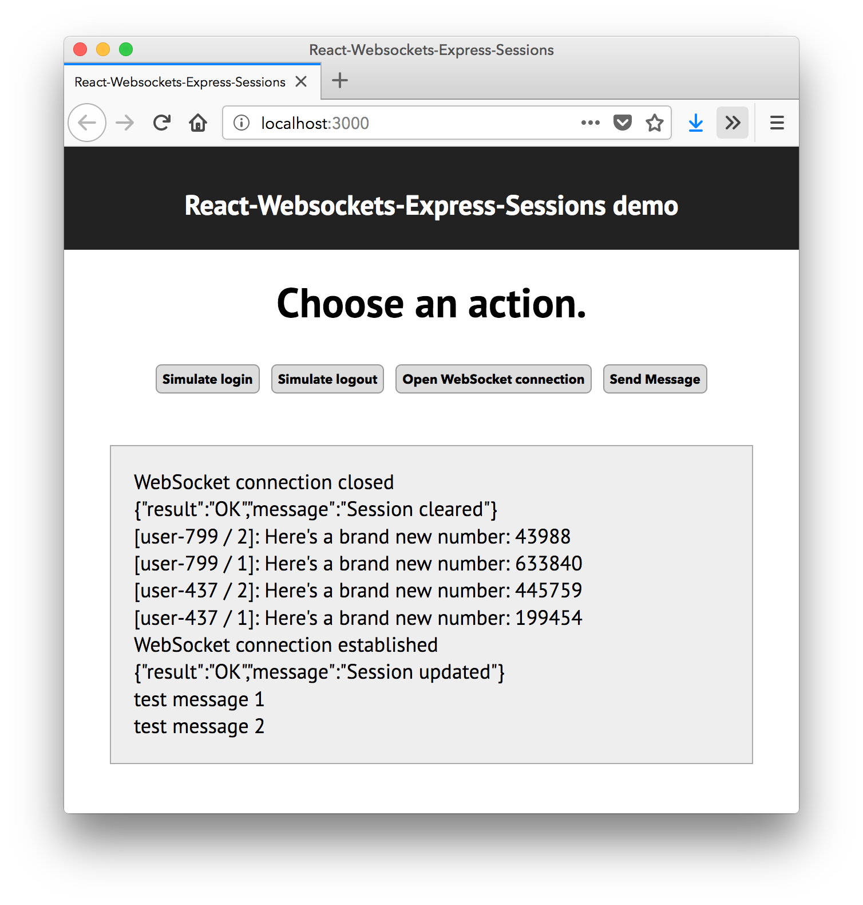

# React-WebSocket-Express-Session example

- [Getting it to work](#getting-it-to-work)
  - [Using the application](#using-the-application)
- [The Client](#the-client)
  - [Fetch API](#fetch-api)
  - [Websocket](#websocket)
  - [The 'key' warning](#the-key-warning)
- [The server](#the-server)
  - [CORS config](#cors-config)
  - [Setting up the session](#setting-up-the-session)
  - [The `/login` and `/logout` routes](#the-login-and-logout-routes)
  - [Setting-up the websocket server](#setting-up-the-websocket-server)
  - [The websocket callbacks](#the-websocket-callbacks)
- [Wrapping up](#wrapping-up)

This directory contains an example application demonstrating how websockets and express sessions can be combined. It is adapted from the [_express-session-parse_](https://github.com/websockets/ws/tree/master/examples/express-session-parse) example in the official `ws` repository, but adapted to:

1. demonstrate the use with React;
2. demo more use-cases (e.g. broadcasting messages, and updating info in the session);
3. work with the webpack-devserver (and create-react-app).

It also shows how to use the Fetch API.

## Getting it to work

Open two terminals.

Terminal 1:

```sh
cd ws-session-server
npm install
node server.js
```

Terminal 2:

```sh
cd ws-session-client
npm install
npm start
```

### Using the application

It is basically a very limited chat application. Logged in users can transmit random numbers to each other 😃



Here's how to use the buttons:

- **Simulate Login** To have the server create a session that contains the user name.
- **Simulate Logout** Clears the session on the server.
- **Open Websocket Connection** Start a web-socket connection from this browser to the server. This connection attempt will fail if the user has not logged in yet.
- **Send Message** Send a random number to the server, who will broadcast it to all browsers connected to the server.

To demonstrate how you can change data in the session from both normal (i.e. regular HTTP) Express routes, and from websocket message callbacks, the server also maintains a message count for each user. This will be added to the messages being broadcast.

Here's how to play with the app:

1. Start the two servers. See instructions above.
2. Open two different browsers (i.e. Chrome and Firefox) to [`http://localhost:3000`](`http://localhost:3000`).
3. In each browser, press **Simulate Login**.
4. Look at the output in from the Express server in the terminal to see that sessions and user names were created.
5. In each browser, press **Open Websocket Connection**.
6. Look at the output from the Express server in the terminal to see that the web-socket connections were accepted, and that the websocket code has access to the user name that was stored in the session.
7. Press **Send Message** in both browsers, multiple times, to see the messages being broadcast, and to see that the websocket code in the Express server adds info from the session (user name and message count) to the message text.
8. Press **Simulate Logout** in one of the browsers, and then try to send messages from that same browser. See that nothing is received by the clients, and that the Express server outputs both the logout and the rejection of messages.

Also, try to open a websocket connection when you have not logged-in yet, just to enjoy more feelings of rejection 😉

## The Client

The client is a React app, created with `create-react-app`. That means it will run on a webpack-devserver, which will run on port 3000.

The only React component is in `App.js`. It has a list of messages as it's only state. Pressing the buttons will call event handlers that use methods from the module `serverCommunication.js` for both normal AJAX requests (logging in and out), and for websocket requests (opening the connection, and sending messages). Any results returned from the server will simply be added to the messages list.

### Fetch API

The module `serverCommunication.js` has two methods that perform AJAX requests using the new Fetch API, which is a successor to XMLHttpRequest API. Fetch uses promises, and you can see from the code that both methods return a _promise_ that will resolve to the response from the server, but could also be rejected if something goes wrong:

```js
export function startLogout() {
  return fetch(serverFetchBase + '/logout', {
    method: 'DELETE',
    credentials: 'include',
    mode: 'cors',
  }).then((response) => checkFetchError(response))
}

function checkFetchError(response) {
  return response.ok
    ? response.json() /* this returns a promise that
                         resolves to the json data
                         from the server */
    : Promise.reject(new Error('Unexpected response'))
}
```

In `App.js`, these methods can be used like this:

```js
startLogout()
  .then((msg) => this.addMessage(msg)) // Server responded ok; deal with the data from the server.
  .catch((err) => this.addMessage('ERROR: ' + err.message)) // Something went wrong.
```

Note that the call to `fetch` needs some optional parameters that were not needed for old-style AJAX code: `credentials: 'include', mode: 'cors'`. This is required because the Express server is running on a different port (4000). To a browser, this means that it is a completely different server, and modern browsers have all kinds of security rules and restrictions for dealing with servers that are not the server that the original HTML page came from. See [CORS (Cross Origin Resource Sharing)](https://developer.mozilla.org/en-US/docs/Web/HTTP/CORS).

Just copy these extra options into your `fetch` calls whenever you're using the webpack-devserver (this client app was made with create-react-app, which uses webpack-devserver).

The _server_ also needs a few extra lines to get it to work according to the CORS rules that browser like; see the next section on the server-code.

### Websocket

In a React app, you generally want to create a single websocket, and to use that websocket from different React components. Therfore, we put the websocket iin a separate module, called `serverCommunication.js`. By making it a module, it can be imported by any React component in your app.
An even nicer implementation would maintain the websocket as a real singleton, and fold the `getWebSocket()` and `openWebsocket()` functions into one. This was not done in this app, to allow you to experiment with the status of the connection. The singleton-in-an-ES6-module pattern is worth considering for your own websocket application, although Redux applications don't need it.

If you try to connect _before_ logging in, it will fail without sending a nice message to the browser. This is not a programming error, just a consequence of how the server-side code checks connection attempts and rejects them if the user has not logged in.

### The 'key' warning

This app renders all messages in a loop, without giving the resulting JSX elements a 'key' attribute. This causes React to give the well known warning about needing 'key' attributes in repeated elements.
In this demo, creating decent keys would make the code more complicated, but using _stupid_ keys (such as the array index) would set a **bad example**. So we just did not provide keys on purpose, and left the 'key' warning in place.

## The server

The server is an Express application with an attached Websocket server. You've already seen how this is done. These are the interesting bits for this example:

### CORS config

A few lines were added to deal with the CORS difficulties caused by having a separate server for the client code.

```js
// needed for using webpack-devserver with express server
const cors = require('cors')
```

This middleware module sets special HTTP headers to get the browser to accept information coming from this server. But it needs some configuration before installing it into Express:

```js
// needed to make all requests from client work with this server.
app.use(cors({ origin: true, credentials: true }))
app.options('*', cors({ origin: true, credentials: true }))
```

This is stuff that you simply need, so copy-paste it into your own program.

### Setting up the session

The `express-session` middleware is set-up a little bit differently from code you've seen before. Instead of creating the session middleware directly as a parameter to `app.use()`, we create the middleware first, store it in a variable (`sessionParser`), and only then do we call `app.use()`:

```js
const sessionParser = session({
  saveUninitialized: false,
  secret: '$eCuRiTy',
  resave: false,
})
app.use(sessionParser)
```

This gives us a reference to the session middleware, which we need to keep: Later on, when the websocket connections are created, we're going to apply the `sessionParser()` ourselves to make the session available to websocket code. See the next section on "Setting up the websocket server".

### The `/login` and `/logout` routes

These are basic Express routes. Not much tricky stuff going on here:

- The `/login` route will send an authorization error to the client if the password is incorrect. Replace with a more professional solution in your own app.
- The `/login` route sets some values into the session for this user. These values will be used by the websocket code to decide if the socket connection should be accepted, and to decorate incoming messages with the user name and the user's message counter.
- The `/logout` route removes the values from the session. It does not destroy the session, because, for unknown reasons, any _new_ session, that would have to be created when the user logs in again, is never made available to the websocket code.

### Setting-up the websocket server

The code that initializes the websocket server is this:

```js
const websocketServer = new WebSocket.Server({ noServer: true })
```

The noServer-option is used because we want to implement the connection between the HTTP server and the web server ourselves by handling to the 'upgrade'-event of the HTTP server like you see in the code below.

```js
httpServer.on('upgrade', (req, networkSocket, head) => {
  sessionParser(req, {}, () => {
    if (req.session.userName === undefined) {
      networkSocket.destroy()
      return
    }

    console.log('Session is parsed and we have a User!')

    websocketServer.handleUpgrade(req, networkSocket, head, (newWebSocket) => {
      websocketServer.emit('connection', newWebSocket, req)
    })
  })
})
```

Besides deciding whether to accept the connection, this function does something that is vital to allow websocket code access to the session: it calls the `sessionParser` on
the request object created for the HTTP request used to set-up the websocket connection. The important effect of this is that it installs the session object into this request object. If we do not do this here, our websocket callbacks can't get access to the session.

### The websocket callbacks

Actually receiving and responding to websocket messages is done in callbacks. That is the code where we would like access to the session-object, for example to know which logged in user belongs to this websocket message. Below is the standard template for the code to set-up the callback, but with some extra's for dealing with sessions:

```js
websocketServer.on('connection', (socket, req) => {
  socket.on('message', (message) => {
    req.session.reload((err) => {
      if (err) {
        throw err
      }

      //  your own code here

      req.session.save()
    })
  })
})
```

Note how this code calls `reload()` and `save()` on the session. In normal Express routes, you don't have to do that because Express does that for you. But in websocket code we have to do it ourselves. If you forget the `reload()` and `save()` calls, you cannot mix normal Express routes and websocket callbacks if they both change information in the session.

See the actual code in the example to see how, in this chat-application, this callback contains code to check if the user is logged in, and if so, send the message to all connected browsers.

## Wrapping up

If you use this example as a starting point for your own project, these are the bits of code you should copy-paste into your own files:

- If you choose to use `fetch()` on the client: the extra properties to the `fetch()` calls: `credentials: 'include', mode: 'cors'`
- On the server:
  - The 3 lines of CORS code, see above.
  - The code for setting-up the `sessionParser` (change the secret, of course).
  - The template for responding to websocket messages shown in the previous section. Between the calls to `session.reload()` and `session.save()`, your code can do its thing.
