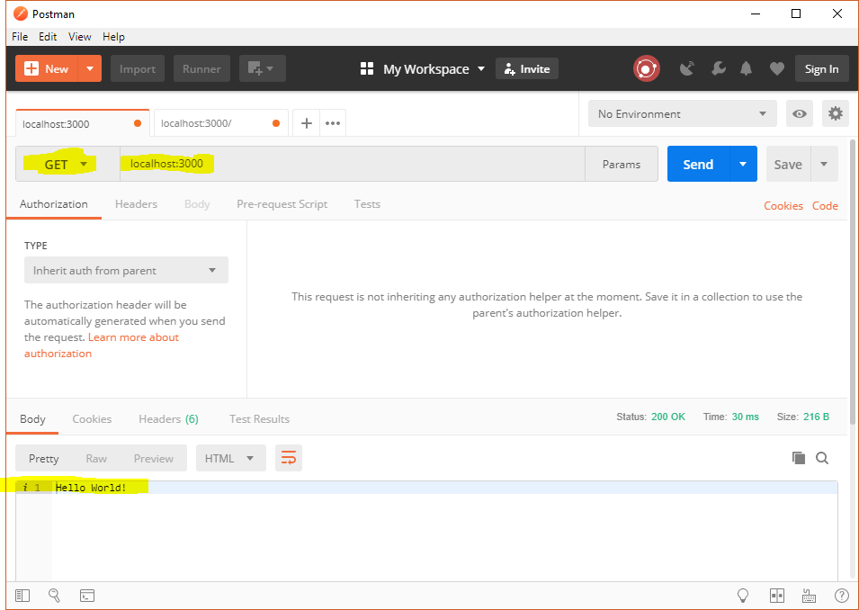
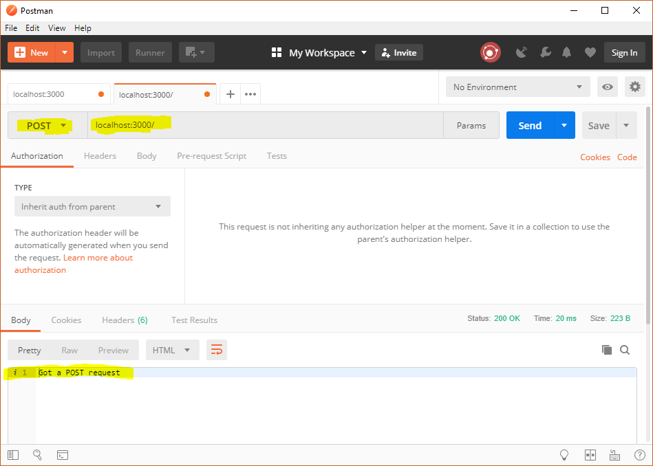
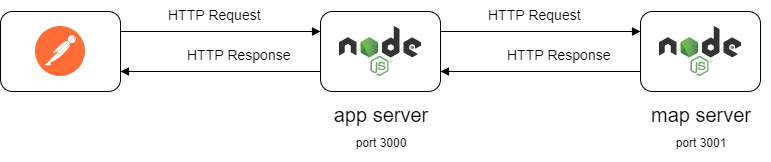
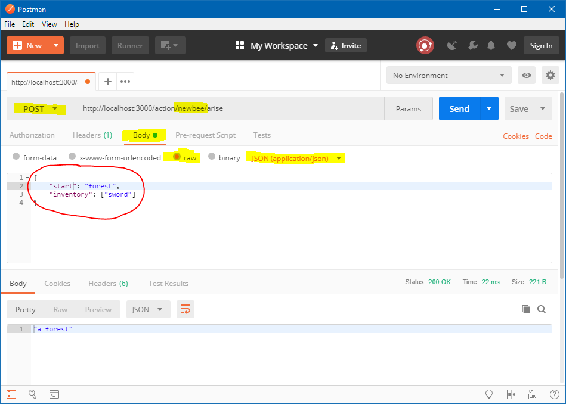

# Unit 3: Express

- [Objectives](#objectives)
- [Session 3-1: Introduction to Express](#session-3-1-introduction-to-express)
  - [Preparation 1: 'Hello World Example'](#preparation-1-hello-world-example)
  - [Preparation 2: 'Basic Routing'](#preparation-2-basic-routing)
  - [Preparation 3: 'Static Files'](#preparation-3-static-files)
  - [Preparation 4: Assignment 3A - 'ICA Adventure in Express'](#preparation-4-assignment-3a---ica-adventure-in-express)
  - [Preparation 5: Assignment 3B - 'ICA Adventure for multiple users'](#preparation-5-assignment-3b---ica-adventure-for-multiple-users)
  - [Preparation 6: Q & A](#preparation-6-q--a)
  - [Classroom activities](#classroom-activities)
  - [Assignment 3C - 'Starting a new game'](#assignment-3c---starting-a-new-game)
- [Session 3-2: Growing your Express App](#session-3-2-growing-your-express-app)
  - [Preparation 1: Assignment 3D - 'Load game state middleware'](#preparation-1-assignment-3d---load-game-state-middleware)
  - [Preparation 3: Assignment 3E - 'Game file management'](#preparation-3-assignment-3e---game-file-management)
  - [Preparation 4: Assignment 3F - 'Organize your app'](#preparation-4-assignment-3f---organize-your-app)
  - [Preparation 4: Q & A](#preparation-4-q--a)
  - [Classroom activities](#classroom-activities-1)
- [Session 3-3: Small-test](#session-3-3-small-test)
  - [Preparation](#preparation)
  - [Classroom activities](#classroom-activities-2)

## Objectives

This week you'll get to know the Express web framework for Node.js and learn how to use it.
At the end of this week you should be comfortable with:

- routing;
- middleware;
- static content;
- the parameters `err`, `req`, `res`, and `next`;
- API-testing your application with Postman.

## Session 3-1: Introduction to Express

### Preparation 1: 'Hello World Example'

> **A) Do the tutorial**

1. Read the first part of <https://expressjs.com/en/starter/hello-world.html> (up to section 'Running Locally') and follow the instructions.
1. Navigate to folder `myapp` in your personal repo and you'll see `app.js`, containing all code from step 1. You'll also see the file `package.json`.
1. Install all dependencies by running `npm install` (this command makes npm download and install all packages located in `package.json`).
1. Start the Express server by running `node app.js`.
1. Navigate to <http://localhost:3000> with any browser and check the if the response is equal to `Hello World!`.

> **B) Playtime**

Whenever you make changes to your code, you will need to restart the server to see your changes. This will quickly become very tedious. Luckily, the [Nodemon](https://nodemon.io/) utility will automatically restart the server for us whenever it detects a file being changed.

You'll need to install the package nodemon globally in order to be able to use it as a command on the command-line.

1. Install nodemon globally by running `npm install -g nodemon`.
1. Use `nodemon` (instead of `node`) to start your app by using the command `nodemon app.js`.
1. In `app.js` create a variable `nRequests` that will count the number of requests the server receives.
1. Increase this number by one every time the server responds with 'Hello World!' and log this number to the console of the server application.
1. Test your program by making a few requests in the browser and checking the output in the console of the server.
1. The `req` parameter refers to a request object that holds the HTTP request information amongst other things.
   Show the information available on the browser that is making the request by logging `req.headers['user-agent']` to the console.
   Test the app with different browsers and inspect the differences.
1. Remove `res.send('Hello World!')` and inspect the output of the browser.

_**Note:** instead of installing nodemon globally, you can also run it locally (without installation) by using the [Node.js Package Runner `npx`](https://nodejs.dev/en/learn/the-npx-nodejs-package-runner/) command; e.g. `npx nodemon app.js`._

### Preparation 2: 'Basic Routing'

> **A) Do the tutorial**

1. Navigate to the folder `basic_routing`.
1. Inside this folder run `npm install` to install express.
1. Read the text from <https://expressjs.com/en/starter/basic-routing.html>.
1. Inspect `app.js` and you'll see that all code blocks from the text have been added to the Express server app.

The server app now has four route handlers, which means it can now respond to four different requests. Unfortunately it's hard to make browsers issue any other request than a GET request.
Therefore we will use another client app for testing the route handlers of the server.

This client app is called Postman.

1. Install Postman from <https://www.getpostman.com>.
1. Now test all routes with Postman. See screenshots below for some examples.





_**Tip:** as you can see, you can also create new tabs (like in a browser) by clicking the `＋` icon._

> **B) Playtime**

In this particular case, our Express code sends back HTML (using `res.send`). Find out how you can send JSON to the client, implement this in one of your route handlers and test it using postman.

### Preparation 3: 'Static Files'

Inspect the guide about static files at <https://expressjs.com/en/starter/static-files.html>.

### Preparation 4: Assignment 3A - 'ICA Adventure in Express'

In this assignment you will create an Express app that provides an interface to the ICA Adventure game.

When the client issues a HTTP request that contains the desired command (e.g. `where` or `goto`) in the URL, the server responds with the result of this command in JSON format.

For example `GET localhost:3000/action/where` should result in:

```json
{
  "description": "a town",
  "exits": ["forest", "mountain"]
}
```

We use the GET method because this command only retrieves information.

Note that the JSON response only returns the data and no friendly user message like the ones we created earlier:

```text
you are in a town
and you can go to these location(s):
- forest
- mountain
```

The command `POST localhost:3000/action/goto?location=forest` might result in:

```json
{
  "description": "a forest"
}
```

In this case we use a POST method, because we want to change data on the server.

The name of the new location is located in the query string part of the URL.

The express app still relies on `game.js` for all game related logic. The only responsibility of the express app is to receive an incoming HTTP request, call the correct function or functions in `game.js` and send back JSON data that is based on the result of these functions.

Note that `game.js` still uses a separate map server to retrieve the initial data of the locations.

Below you'll see a picture of the architecture.



The app server and map server now run on the same machine (yours), so they need a different port in order for your machine knows to which server a incoming HTTP request needs to be directed. In reality you would probably deploy the two server apps on different machines with different IP addresses.

> **A) Setting things up**

1. Open a console and navigate to `assignment_unit_3a`.
1. Run `npm install`.
1. Start the app server with `nodemon app.js`.
1. Also start the map server with `node map_server.js` (you won't need nodemon because you won't be making any changes to this file).
1. Open Postman and issue `GET localhost:3000/action/where` and check that you got the correct response.

> **B) Create the code for moving**

Implement the route handler for moving to a new location. Use the Express API docs to find out how to get your hands on the content of the query string: <https://expressjs.com/en/4x/api.html#req.query>

> **C) Submit Solution**

[Use the form on this page to submit the url of your commit.](https://dwa-courses.firebaseapp.com/assignment_swd_3.1.html)

### Preparation 5: Assignment 3B - 'ICA Adventure for multiple users'

We have created a problem: the web server is open to many users, but our game code stores the changes in two variables (`player` and `map`), which means changes from one user will overwrite data from another user.

> **A) Creating a JavaScript class for Game**

To solve this we will create a new `Game` object for every user that plays the game and store `player` and `map` as instance variables. We will call the values of `player` and `map` the _state_ of the game.

- Now take a look at the code in `game.js`.

As you can see, we have created a class. The instance variables `_player` and `_map` are initialized in the constructor of the class. The `_` in front of the variable names is a signal that these variables are meant to be private (they are _not_ private, it's just a convention).

> **B) Storing the Game state**

The main drawback is that we lose this data whenever we restart the server, so we need a way to persist the state of a game. For now we will store this state as a JSON file in the folder `game_files` on the file system. The name of the file corresponds to the name of the player (so the game state of user 'han' is stored in `han.json`).

_A lot of web applications store the data in a database instead of a file system and we will cover the NoSQL-databases MongoDB in unit 6._

- Now take a look at the first route handler in `app.js`.

The flow in the route handler is as follows:

1. Identify the player from the URL.
1. Load the game state for that user from the file system.
1. Create a new `Game` object from the loaded state (this is why the constructor takes a state parameter).
1. Use this game object to call the method that corresponds to the action that was specified in URL.
1. Use the return value of the method in the previous step to send the back a response back to client.

> **C) Identifying the player in the route handler**

To identify the player that issued the request we use a so called _Route Parameter_. A route parameter is a segment of the URL that can have variable values (like a player name).

In Express (and many other web frameworks) we denote a route parameter by putting a colon in front of the string, like so `app.get('/action/:player/where', ...)`. Inside the route handler the value of player (e.g. `han` or `femke` is available in `req.params.player`).

So if the player 'han' requests the information of the location he is in, the URL should look like `localhost:3000/action/han/where` and this should be the URL for 'femke' `localhost:3000/action/femke/where`.

See <https://expressjs.com/en/4x/api.html#req.params> in the express documentation for more information.

_**Note:** Putting your identity in the URL is not very secure (especially when this name points to a file on the server). A better solution is to use sessions for player identification and we will cover sessions in unit 4 (next week)_.

> **D) Finally, let's code**

Now implement the route handler for `app.post('/action/:player/goto', ...)`. Use the flow as above, but don't forget to save the new state to the file. To get the state from a game object, use the getter like so `game.state`.

> **E) Submit Solution**

[Use the form on this page to submit the url of your commit.](https://dwa-courses.firebaseapp.com/assignment_swd_3.1.html)

### Preparation 6: Q & A

[Please submit one question about the code, the reading sections, or any other Express related subject here.](https://dwa-courses.firebaseapp.com/qna_swd_3.1.html)

### Classroom activities

- **Q & A** — We'll try to answer as many of your wonderful questions as time will allow.
- **Homework discussion** — Feedback and in-depth discussion based on your homework submissions.
- **New material**
  - Middleware
  - Body Parser

### Assignment 3C - 'Starting a new game'

In this Assignment you are going to implement the route handler for initializing a new game.

_**Important:** in this assignment we'll assume that the file with the player name already exists on the server.
In [Assignment 3E](#preparation-3-assignment-3e---game-file-management) (in [session 3-2](#session-3-2-growing-your-express-app)) you'll implement the functionality to create a new file on the server_.

Creating a new 'thing' (in this case a new game) is generally done using the POST request having all information in the message body. So the client should issue a POST request to `http://localhost:3000/action/:player/arise` with a starting location and an initial inventory in the message body and the server app will use this information to call the correct methods from the `Game` class. As you can see, the player name (and corresponding game file name) is still in the URL. The response should be the description of the location the player is in.

So, for example a POST request to `http://localhost:3000/action/newbee/arise` with a request-body:

```json
{
  "start": "forest",
  "inventory": ["sword"]
}
```

Should put the player 'newbee' in the location 'forest' with a 'sword' in the list of items. The response is:

```text
"a forest"
```

Below you can find a screenshot of how you can create this request in Postman.



> **A) Implement**

Implement the route handler for `app.post('/action/:player/arise', ...)`.

To avoid some complexity, you don't have to worry about overwriting the data in an existing game file with this request.

_**Hint:** you don't have a previous state, so you can call `new Game()` without a parameter to create a game object with an initial state._

> **B) Submit Solution**

[Use the form on this page to submit the url of your commit.](https://dwa-courses.firebaseapp.com/assignment_swd_3.1.html)

## Session 3-2: Growing your Express App

All exercises below are a continuation of the ICA Adventure in Express.

### Preparation 1: Assignment 3D - 'Load game state middleware'

> **A) Adding middleware**

[First, read about middleware in the official Express documentation.](https://expressjs.com/en/guide/writing-middleware.html)

Every route handler contains the same code for finding and reading the player file:

```js
const fileName = path.join(gameFilesFolderName, `${req.params.player}.json`);
const fileContent = await promiseWrappers.readFileP(fileName);
```

1. Move this repeating code from the three route handlers to the middleware function `gameFileReader`.
1. Make the `fileName` and `fileContent` available to the rest of your application. See the section 'Middleware function requestTime' from [the official Express documentation](https://expressjs.com/en/guide/writing-middleware.html) for an example of how to do this.
1. Make sure `gameFileReader` calls the 'next middleware function'.
1. Register the middleware function `gameFileReader` to the route `/action/:player` with `app.use` above the other route handlers.
1. Test that your application still works with Postman.

> **B) Adding error handling**

[First read about error handling in Express.](https://expressjs.com/en/guide/error-handling.html)

The client might provide an URL with the name of a player that doesn't exist. Currently this request will 'hang' because `readFileP` produces an error (by returning a rejected Promise) that we do not handle appropriately.

1. Add a `try ... catch` block to the `gameFileReader`.
1. In the `catch` block pass the error to the default error handling middleware of Express.
1. Test your application in Postman. If you try this URL `localhost:3000/action/aimen/where` for example, you should see this response:

```html
<!DOCTYPE html>
<html lang="en">
  <head>
    <meta charset="utf-8" />
    <title>Error</title>
  </head>

  <body>
    <pre>
Error: ENOENT: no such file or directory, open &#39;game_files/aimen.json&#39;</pre
    >
  </body>
</html>
```

This error message gives too many low level details (like the `ENOENT` code that `readFile` produces) that are not very helpfull to the client.

1. In the catch block of `gameFileReader` create a new error object and add a simple message that the provided player does not exist.
1. Pass this new error object to the default error handler.

_**If you did not succeed in implementing 'A) Adding middleware'**_
_Create a middleware function that passes `new Error('BOOOM!')` to the default error handling middleware of Express._

> **C) Adding a custom error page**

Now all errors send a standard Express html error page to the client. In this exercise you are going to send one specific error as a JSON object.

1. Create an error handling middleware function that checks if the error was caused by an attempt to read a game file that does not exist. If so, send the error message from the Error object to the client. You can pass any other error to the default error handler.
1. Also send an appropriate status code to the client.
1. Test your implementation using Postman.

_**If you did not succeed in implementing 'A) Adding middleware'**_
_Create an error handling function that checks if the error 'BOOOM!' occurred and send the following JSON object to the client:_

```json
{
  "error": "something horrible happened"
}
```

> **D) Selective middleware**

Sometimes you don't want to use middleware for all your routes, but only a select few. In this part we will look into an example of this.

The route handlers for `/action/:player/where` and `/action/:player/goto` contain two repeating statements that we can put in another middleware function.

```js
const gameState = JSON.parse(fileContent);
const game = new Game(gameState);
```

1. Remove these statements from the route handlers and place them in a middleware function `gameStateReader`.
1. Make sure all errors are passed to the default error handler.

The interesting bit is that the routehandler for `/action/:player/arise` does _NOT_ need this middleware.

1. Find a way to add this middleware function to the route handlers of `/action/:player/where` and `/action/:player/goto`, but not to the route handler of `/action/:player/arise`.

_**Hint:** read the section 'Application-level middleware' of [Using middleware](https://expressjs.com/en/guide/using-middleware.html) to see an example of how you could solve this._

> **E) Submit Solution**

[Use the form on this page to submit the url of your commit.](https://dwa-courses.firebaseapp.com/assignment_swd_3.2.html)

### Preparation 3: Assignment 3E - 'Game file management'

In this exercise we are going to add routes to support the management of complete game files. We want to add the following capabilities to the app:

1. getting the list of files in the `game_files` folder;
1. deleting a specific game file;
1. creating a new game file.

These file management tasks are very different than performing actions in an ICA adventure game, so we will use completely different URL's.

> **A) Getting a list of all the files**

We've added some game files to the `game_files` folder that you can find in session 3-2.

For example, the request `GET http://localhost:3000/listPlayerFiles` should yield this response:

> ```json
> ["femke.json", "han.json", "kick - Copy.json", "kick.json"]
> ```

Write the code for this route handler and test it with Postman.

_**Hint:** you can use `readdirP()` in the promise-wrappers get the contents of a folder._

> **B) Deleting a game**

The route handler for `DELETE /deletePlayerFile/:player` should delete the file specified by `:player` (which doesn't include the file extension). It should respond with the message (in JSON) that the specified file was successfully deleted.

For example, the request `DELETE http://localhost:3000/deletePlayerFile/kick` should delete `game_files/kick.json` and respond with:

> ```json
> {
>   "result": "game kick.json removed"
> }
> ```

Implement the route handler and test it with postman.

_**Hint:** use `unlinkFileP()` in the promise-wrappers to delete a file._

_**Tip:** you can use `kick - Copy.json` to quickly create a new `kick.json` to replace the deleted one._

> **C) Creating a new game file**

The route handler for `POST /createPlayerFile` creates a new game file based on the value of the request body. The request body should be a stringified JSON object with a name property. The value of this property will determine the name of the game file.

For example, a request with the following body should create a new empty file called `pristine.json`:

> ```json
> {
>   "name": "pristine"
> }
> ```

Implement this route handler and test it with Postman.

_**Hint:** As always you can use the function `createEmptyFileP()` from the promise-wrappers to create an empty file._

> **D) Submit Solution**

[Use the form on this page to submit the url of your commit.](https://dwa-courses.firebaseapp.com/assignment_swd_3.2.html)

### Preparation 4: Assignment 3F - 'Organize your app'

Currently all our routes are defined on our main app. In the long run this might lead to maintenance difficulties. We want to split our app in two 'mini-apps': one for handling the management of game files and one for handling all the in-game actions.

To accomplish this we can use the class `express.Router` from the Express framework.

> **A) Reading about the router**

Read the section 'express.Router' (it's the last section at the bottom of the page) from [Routing](https://expressjs.com/en/guide/routing.html)

_**Note:** as you can see in the example you don't have to use the keyword `new` to create a new `Router` instance._

> **B) Making the changes**

1. Create a folder `routes` and in this folder create the files `actions.js` and `games.js`.
1. In the file `games.js` create a new router for the game file management. Move all routes concerning game administration to this new router and make sure to export this router.
1. Do the same for all routes concerning the in-game actions. Move them to the file `actions.js`.
1. In `app.js` require both routers and attach them to the main app.
1. Finally, remove the middleware you created in [Preparation 1: Assignment 3D](#preparation-1-assignment-3d---load-game-state-middleware) from the main app and move it to the router that actually needs it.
1. Test your app with Postman and make sure it's working again.

> **C) Submit Solution**

[Use the form on this page to submit the url of your commit.](https://dwa-courses.firebaseapp.com/assignment_swd_3.2.html)

### Preparation 4: Q & A

[Please submit one question about the code, the reading sections, or any other Express related subject here.](https://dwa-courses.firebaseapp.com/qna_swd_3.2.html)

### Classroom activities

1. **Q & A** — We'll try to answer as many of your wonderful questions as time allows.
1. **Homework discussion** — Feedback and in-depth discussion based on your homework submissions.
1. **Express quiz** — Quiz to prepare your for this week's small test

## Session 3-3: Small-test

### Preparation

Prepare for the Small-test by learning:

1. <https://expressjs.com/en/guide/routing.html>
1. <https://expressjs.com/en/guide/using-middleware.html>
1. <https://expressjs.com/en/guide/error-handling.html>
1. The following sections of the Express API: [res.send](https://expressjs.com/en/4x/api.html#res.send) and [req.params](https://expressjs.com/en/4x/api.html#req.params)

In the test you will find general questions about Express and you'll have to write a few lines of Express code from memory.

### Classroom activities

1. **The Small Test** — Earn some points!
1. **Complete this week's assignment**
