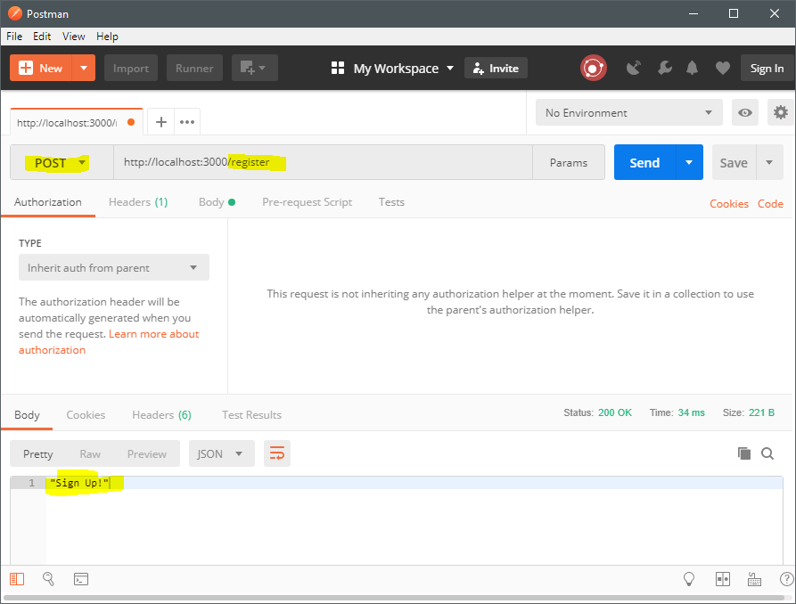
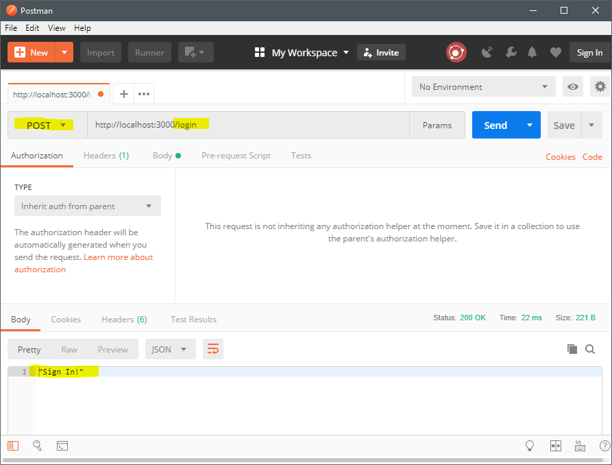
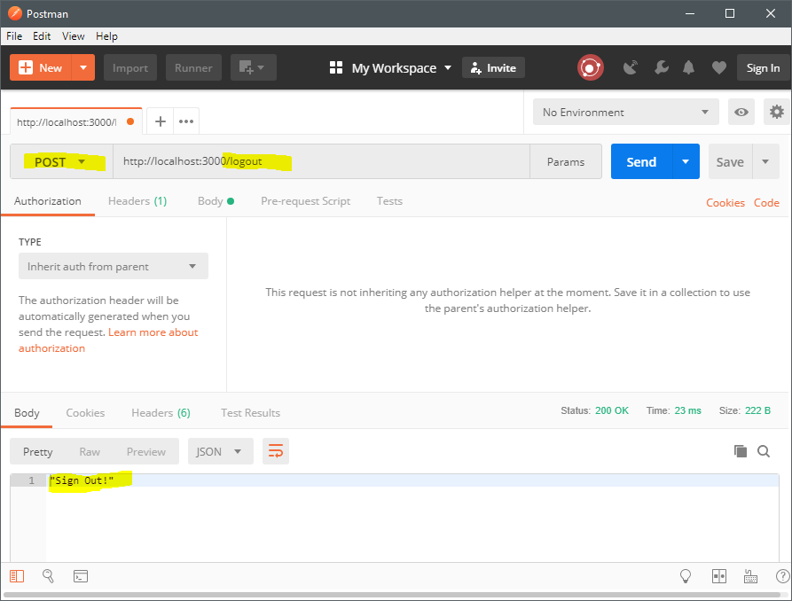
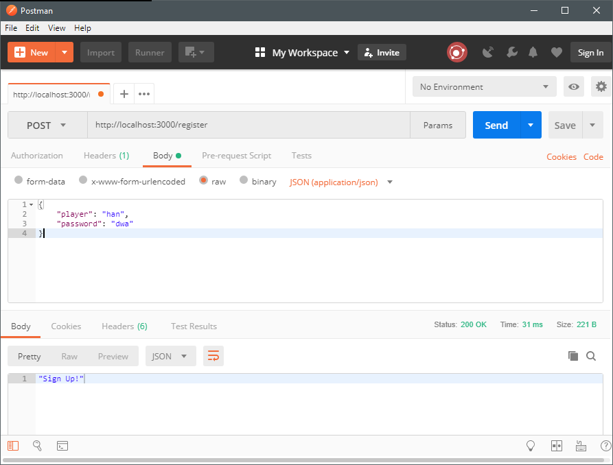
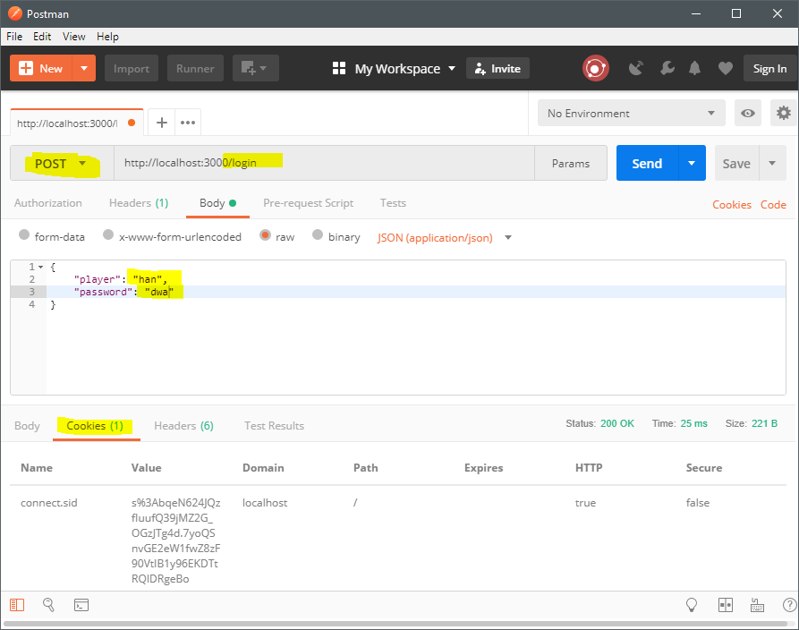
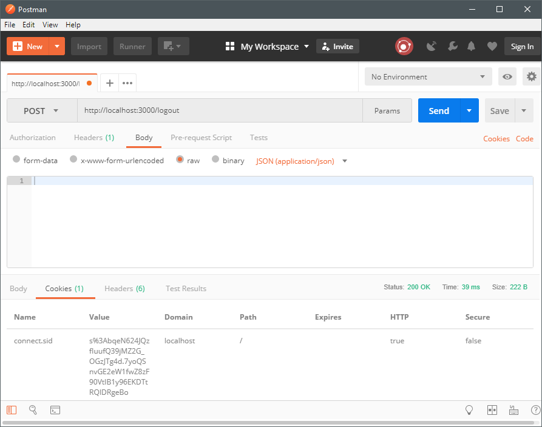

# Unit 4: Sessions & REST

- [Objectives](#objectives)
- [Session 4-1: Sessions in web applications](#session-4-1-sessions-in-web-applications)
  - [Introduction](#introduction)
    - [Cookies](#cookies)
    - [Sessions](#sessions)
    - [Sessions and HTTP scalability](#sessions-and-http-scalability)
    - [Sessions in Express](#sessions-in-express)
  - [Preparation 1: Read and Watch](#preparation-1-read-and-watch)
  - [Preparation 2: Q & A](#preparation-2-q--a)
  - [Preparation 3: Assignment 4 - 'ICA Adventure with sessions'](#preparation-3-assignment-4---ica-adventure-with-sessions)
    - [Step 1: Prep your app](#step-1-prep-your-app)
    - [Step 2: Add register, login and logout](#step-2-add-register-login-and-logout)
    - [Step 3: Add player file with password](#step-3-add-player-file-with-password)
    - [Step 4: Remove `:player`](#step-4-remove-player)
    - [Step 5: Install `express-session`](#step-5-install-express-session)
    - [Step 6: Sign in](#step-6-sign-in)
    - [Step 7: Sign out](#step-7-sign-out)
    - [Step 8: Use the session in actions](#step-8-use-the-session-in-actions)
  - [Classroom activities](#classroom-activities)
- [Session 4-2: Representational State Transfer (REST)](#session-4-2-representational-state-transfer-rest)
  - [Introduction](#introduction-1)
    - [So what is a Web API?](#so-what-is-a-web-api)
    - [REST and HTTP](#rest-and-http)
    - [REST vs SOAP](#rest-vs-soap)
    - [REST easy](#rest-easy)
    - [How RESTful is your REST?](#how-restful-is-your-rest)
  - [Preparation 1: REST video's](#preparation-1-rest-videos)
  - [Preparation 2: Q & A](#preparation-2-q--a-1)
  - [Classroom activities](#classroom-activities-1)
- [Session 4-3: Small-test](#session-4-3-small-test)
  - [Preparation](#preparation)
  - [Classroom activities](#classroom-activities-2)

## Objectives

This week you'll...

- see how 'cookies' are used to deal with the fact that HTTP is a connectionless and stateless protocol;
- see how 'sessions' are useful for server code to remember earlier interactions with the same client;
- make your own application using sessions in Express and React;
- understand why REST is a popular way to organize the communication between client and server over AJAX;
- understand how NodeJS and Express make it easy to create your own REST-ful web server API;

## Session 4-1: Sessions in web applications

### Introduction

#### Cookies

In 1995 (the year the web became popular), an expensive web server machine [cost about 25.000 dollar](http://www.thefreelibrary.com/Sun+announces+fastest+SPARCstation+20,+SPARCserver+20%3B+Reduces+prices...-a017545302), and had 64 _mega_ bytes of memory. That is about 1/8000th of the memory of the first Apple Watch. Sixteen Mb or even four Mb was more typical for a web server. Back then, the HTTP protocol was the best protocol for making data available to as many online users as possible, for one smart design decision: HTTP closed the connection to the server after each request-response interaction. The server did not have to remember _anything_ after the request had been handled, so this precious 4, 16 or 64 Mb was not going to fill up with bookkeeping data on all the open connections. This forgetfulness of HTTP server software made the web _scalable_: capable of increasing its capacity very fast.

This forgetfulness did cause a bit of a problem, however: You can't tell whether an HTTP request is coming from the same user as an earlier request. So you can't remember if, for example, that previous request was a successful login attempt. Which means that you can't know that the next requests coming from that same browser should be allowed to access pages that require being logged-in.

And so, around 1995, some engineers at Netscape (a browser-maker from which Mozilla, the makers of Firefox, is a descendant) proposed a solution: instead of the server remembering which requests are coming from the same browser, let's have the browser _tell_ the server that this is the case. If every browser added some unique code to each of it's requests to a particular server, the server could recognize the request as coming from the same browser, without it having to keep open a TCP connection. Like José Vidal said in one of the first video's for the CWD course: this solution is a bit like having to remind a forgetful grandparent who you are by having to repeat "It's me Grandma: Billy!" with every sentence in the conversation.  
These codes, that the browser has to send to the server are called "_cookies_", and in order to prevent browsers sending the same cookies by accident, the decision was made to have the server decide the contents of the cookie. This gave rise to two new HTTP headers:

After the server adds this header to one of it's responses:

```http
Set-Cookie: sessionId=12345678; loggedIn=true; Expires=Fri, 13 Aug 2030 18:20:14 GMT
```

the browser must add the following header to _every_ request it makes to the same server (until Friday the 13th in 2030):

```http
Cookie: sessionId=12345678; loggedIn=true
```

In this example, `sessionId=12345678` might be a code number that the server software uses to associate requests with browsers/users. The second part, `loggedIn=true`, was added to this example to show that cookie content is typically a small set of variables with simple values.  
The `Expires`-part tells the browser when it may stop including the cookie in every request. If the `Set-Cookie` header does not have an expiration date, the browser must stop sending the cookie when the browser is closed.

This is a clever idea: The server _still_ doesn't have to keep connections open, so its tiny memory capacity does not fill up very quickly. Having to store the cookie-information on the browser is less of a problem: The browser is probably not sending thousands of requests per second to thousands of different servers. So it only has to keep track of just a few cookies, which it can store on the hard disk. So by using browser memory, instead of server memory, cookies are adding the benefits of connectedness to a connectionless protocol.

_**Video:** Here is a video that shows you how you can set cookies, and read cookie data in a NodeJS Express app: [Cookie In Express: Node.js](https://www.youtube.com/watch?v=mdvQ74KL-fU) by Satish B (not required for the preparation or the test)._

Cookies turn HTTP from a stateless protocol into a _stateful_ one: the server can, if it wants to, set multiple variables inside a cookie (but the total size must not exceed 4 Kb). Combine that with the fact that the server can replace the content of a Cookie with new content (i.e. update one or more of the variables in the cookie), and you can have some set of changing data, that is associated with this interaction between one browser and the server. It's like having _state_ (=a set of changing data) that belongs to a _connection_ (i.e. a series of requests between two machines), in a connectionless and stateless protocol! How cool is that?

Well, it's cool, but it's not secure. The client might lie to the server. If your web application would keep it's payment information inside a cookie, then any client might fool the server into believing a user has already paid, by sending false cookie information.  
Payment information, and other info that's interesting to cheaters (how many lives are left in the game? is the user logged in?) is best kept on the server, not on the client. That is why many web development platforms have built the concept of _session_ on top of the cookie-functionality of HTTP.

#### Sessions

The idea behind _sessions_ is to keep the cookie simple --just some id-code-- and keep the data that the server needs to know about the interaction with the browser safely in the server itself. The server uses the id-code from the cookie it receives to look for the session data in some data store: a JavaScript object in main memory (or, similarly, a PHP array or Java dictionary), or in some database, or even in the the server's filesystem. It may then use the session data to help generate the HTTP response.

Up until now, this text has used terms such as "interaction between the server and a browser", or "series of requests from a browser" to describe the important thing that HTTP does not support, but which web developers really need. From this point on, we'll replace those descriptions with the term "session". So the word _session_ in the context of web development stands for two related things: (1) the use of cookies for keeping track of a series of HTTP request coming from the same browser, and (2) the set of data that the server maintains for this series of requests and finds by using a session-id found in the cookie headers of the requests.

The data that is stored most often in a session is, of course, login information: has the user logged in? What's his/her user-id? etc. In many applications, this will be the _only_ information that's kept in the session store. Information in a session is short lived: As soon as the user closes his/her browser, the cookie with the session-id will be lost. Often, servers configure the cookie to expire even earlier; for example after 15 minutes of inactivity. So for any information you'd like to remember about a user, the web developer must decide if this info should last longer than the session, or if it is OK to lose the info when the session dies.

_**Article:** Now, read this text about how sessions work: [How does a web session work?](http://machinesaredigging.com/2013/10/29/how-does-a-web-session-work/) by Elodie (required part of the preparation)._

In contrast to the video link above, this one _is required_ reading: it's part of the preparation and the small test.  
The text is not specifically about NodeJS or Express. In fact, the author seems to live in a PHP world. But everything in this text applies to JavaScript servers as well as to servers written in PHP, Java, Ruby and many others.

One final word about the session store. Most platforms allow you to choose how to store session information. The default is usually just a data structure in main memory, and the alternative is usually some very fast database (Redis, for example, is a popular one for session storage in the NodeJS world).  
But even if your database is _very_ fast (and Redis is much faster than MySQL of MongoDB for simple tasks like this one), it is still much slower than if the session data is kept in main memory as a data structure in your NodeJS app. Why would a web developer choose to use an external database for storing session data, if it makes the app slower?  
There are two arguments for using a database as a session store:

1. Session data in a DB will survive web server restart's. Your server might crash from time-to-time, or you need to restart the server to update some of the programming code. If the data is kept in main memory, the data will be lost when the server process stops.
2. You can scale-out your application. If your site becomes very busy, you may need to use multiple web server machines to handle the traffic. A load-balancer will distribute the incoming request among all your web servers, usually in a random manner. Different requests coming from one particular browser may be handled by many different web servers.
   If you store session data in the main memory of, say, the web server that handled the successful login request, that session data will not be accessible from other machines. If you keep the session information in a database, all server machines can access the session data by asking the database.

#### Sessions and HTTP scalability

Let's return for a few moments to the original idea behind the stateless nature of HTTP. By allowing the server to forget each request once the response was served, old HTTP servers could handle much more clients than other protocols did. Cookies can be used to shift the memory requirements of remembering session info to the client, allowing some statefulness in an HTTP interaction, but the solution is not secure against cheaters. Sessions solved the cheating problem shifting the session data back to the server. But this solution is in direct contradiction to the idea of reaching scalability by forgetful servers! Can this be true? Does HTTP lose its scalability advantage when you start using sessions inside your application?

Yes. Keeping session state on the server does negate this part of the scalability benefits of HTTP. But working memory is no longer such an incredible bottleneck for the scalability of web servers. Other issues have become the important constraints, such as disk I/O, CPU speed, and network latency. And some other aspects of HTTP still help a lot in making web sites scale, most importantly, the caching functionality of HTTP. Finally, back when a 64 Mb server cost $25.000, the technology for dividing the work of a web server (or a database) among many machines was not developed yet. Now, we need only a single afternoon to scale-out our site to hundreds or thousands of servers using mainstream platforms and cloud services.

#### Sessions in Express

Using sessions in Express is done using the middleware `express-session`. Like `body-parser`, it is provided by the developers of Express itself, but you have to install it separately: it does not come with Express.  
Using this middleware, you don't have to manage the cookies that are needed for the sessions to be recognized. The middleware takes care of the cookies.

Basically, what you do is (1) install the middleware on your Express app, and then (2) use a new JS object that gets added to each Express `request` object you'll receive in your route handlers. This new object is `request.session`, and it is initially empty. It's just a place to store session data. It's up to the developer to decide what data will be stored there.

_**Video:** This is a good moment to watch a video about express-session: [Session Management In Your ExpressJS Web Application](https://www.youtube.com/watch?v=yhCPfPfNEwE) by Nic Raboy (required part of the preparation)._

An interesting aspect of `express-session` that this video does not show, is that you can use it with different session stores. The default one is a main memory store, which is fast but has the drawbacks described above. But is you scroll down [this page](https://github.com/expressjs/session), you'll find a list of many session stores, including modules for MongoDB, Redis, but also your filesystem.

### Preparation 1: Read and Watch

- Read the introduction text above, and
- read the article that is mentioned in the introduction: [How does a web session work?](http://machinesaredigging.com/2013/10/29/how-does-a-web-session-work/) by Elodie, and
- watch the video about Express sessions mentioned in the introduction: [Session Management In Your ExpressJS Web Application](https://www.youtube.com/watch?v=yhCPfPfNEwE) by Nic Raboy.

### Preparation 2: Q & A

[Please submit one question about the code, the reading sections, or any other related subject here.](https://dwa-courses.firebaseapp.com/qna_swd_4.1.html)

### Preparation 3: Assignment 4 - 'ICA Adventure with sessions'

We're going to revisit the ICA adventure and your task is to add authentication to this app. Basically, users should only be allowed to play the game if they're logged in.

#### Step 1: Prep your app

We are going to store the players password in the file associated with the game data of the player.

- In the root of the project, create a new folder, called `player_files`.

#### Step 2: Add register, login and logout

We'll want to put all session management going in a new router.

- In the folder `routes` create a new file called: `players.js`.
- Initialize a new router-object and attach three route handlers: one for the route `POST /register`, one for `POST /login` and one for `POST /logout`. Let the route handler for registration send the text 'Sign Up!', the handler for login 'Sign In!', and the handler for logout 'Sign Out!' to the client.
- In `app.js` attach the newly created router to the app and test your implementation with Postman. Your output should look like the images in the screenshots below.

  

  

  

[Submit the url of your commit in step 2 of this form.](https://dwa-courses.firebaseapp.com/assignment_swd_4.1.html)

#### Step 3: Add player file with password

- Modify the route handler for `POST /register`. The handler should create a new player file based on the information in the body of the request.

  A post request with this body for example:

  ```json
  {
    "player": "han",
    "password": "dwa"
  }
  ```

  should create a file called `han.json` in the `player_files` folder that contains the provide password like this:

  ```json
  {
    "password": "dwa"
  }
  ```

  

- Use Postman to create a file for players 'han' and 'femke'. You can use whatever password(s) you like.

[Submit the url of your commit in step 3 of this form.](https://dwa-courses.firebaseapp.com/assignment_swd_4.1.html)

#### Step 4: Remove `:player`

- Because we are going to use a session to identify the current player, you can remove `:player` from all routes in `actions.js`.

**Note:** You _don't_ have to modify the the file `games.js`, because we won't be using these routes in this assignment.

[Submit the url of your commit in step 4 of this form.](https://dwa-courses.firebaseapp.com/assignment_swd_4.1.html)

#### Step 5: Install `express-session`

- Follow the example in the video to install the `express-session` module using `npm`.
- Then add the `express-session` middleware to `app.js`, because we want to be able to use sessions in all our routes

  The video is your friend here. everything you have to do with `express-session` is demoed in the video.

[Submit the url of your commit in step 5 of this form.](https://dwa-courses.firebaseapp.com/assignment_swd_4.1.html)

#### Step 6: Sign in

In this step you're going to modify the route handler for `POST /login` so that is stores the player name that has logged in. You can store a player name in the session object by adding the property `player` with the corresponding name to `req.session`. For example, you can add the player 'femke' to the session object with this statement:

```js
req.session.player = "femke";
```

Remember that JavaScript just adds the property `player` to the session-object if it does not exists.

Your app should check whether the user supplied the correct password, before signing her in. So the user should supply the player name and the password in the body of the message as you can see in the screenshot below.



- In the route handler of `POST /login` in `players.js` open the file from the folder `player_files` with the name in the body of the http request (`req.body`).
- Check whether the password in the request body is equal to the password in the file you just opened.
- If the passwords match, add the player name to the session as explained above and send 'Sign In!' to the client.
- If the passwords do not match, send back an error message to the client with an appropriate message.
- Test your implementation with Postman and you should see something like the image in the screenshot above.

[Submit the url of your commit in step 6 of this form.](https://dwa-courses.firebaseapp.com/assignment_swd_4.1.html)

#### Step 7: Sign out

Signing out is a lot easier, the only thing you need to do is delete the `player` property from the session object.

- In the route handler of `POST /logout` in `players.js` delete the `player` property from the session object by using the JavaScripts `delete` keyword. Don't forget to send the message 'Sign Out!' back to the client.
- Test the implementation with Postman by sending a post request without a body to `localhost:3000/logout`:

  

[Submit the url of your commit in step 7 of this form.](https://dwa-courses.firebaseapp.com/assignment_swd_4.1.html)

#### Step 8: Use the session in actions

Now we can use the name of the player in the session variable to identify the player and load the correct game file. If there is no player name in the session we know no one is logged in and we send back an error.

- In `actions.js` navigate to the middleware handler you use to load your game file.
- Create an `if`-statement to check whether the variable `req.session.player` exists and if not create an error-object and call the next error handling middleware with this error-object.
- If `req.session.player` exists, proceed as normal, but use `req.session.player` instead of `req.params.player` in the rest of your code.
- Make sure the error-handling middleware can handle this error object and sends an appropriate error message to the client.
- Now test your app with Postman, by testing the actions when the user is logged in and logged out.

[Submit the url of your commit in step 8 of this form.](https://dwa-courses.firebaseapp.com/assignment_swd_4.1.html)

### Classroom activities

- **Q & A** — We'll try to answer a many of your piercing questions as time will allow.
- **Homework discussion** — Feedback and in-depth discussion based on your homework submissions.

## Session 4-2: Representational State Transfer (REST)

### Introduction

REST is a _style_ that describes a way of designing your Web API.

#### So what is a Web API?

A Web API is, in this context, a server application that (1) speaks HTTP with clients, but (2) those clients do not want to get HTML, but data in a format that usable by software. XML will work fine with REST, but JSON is the format that is used most often.  
At first glance, there seem to be two kinds of Web API: some API's are intended to be used by outside developers. The Movie Database ([api.themoviedb.org](https://www.themoviedb.org/documentation/api)) is an example of this, but GitHub, Dropbox and many other interesting Web API's exist that you can use as part your own software.  
The other kind of Web API is what you would create for a single application. If your client is written as an API, than most client-server communication will look like Web API communication: HTTP requests receiving JSON data. So the server you build for this application is making a Web API available to your single-page application (SPA). And when your app becomes popular, and you decide to create a mobile app, you can reuse the same Web API: Even if the mobile app uses a completely different UI implementation: perhaps the Android app is written in Java, using the Android SDK, instead of JavaScript and the DOM. But because native Android apps (and a native iOS apps, too), can issue HTTP requests, and parse JSON, those mobile apps can get data from the server in exactly the same way that a SPA would. Large companies have Web API's that are not public, but do support many different applications.  
So when you think about it, these two kinds of Web API's (public API's for outside developers, and API's that are internal to a single web app) are basically the ends of a spectrum, and there are interesting uses of the Web API concept that fall somewhere in the middle. For example, the final assignment for this course (The Quizzer) can be implemented as _three_ SPA's that access the same Web API.

#### REST and HTTP

REST is a set of opinions that help you decide how to design and structure your Web API. It is not a strict protocol, such as HTTP, and it does not refer to any specific technological method. It is closer to a _design pattern_. You can, if you want, take some of the ideas that are part of REST, and ignore others.  
The first person to write about these ideas was one of the designers of HTTP: Roy Fielding. Many discussions of REST refer to [his PhD dissertation](https://www.ics.uci.edu/~fielding/pubs/dissertation/top.htm) (not required reading), in which he describes the ideas of REST (and also coins the term "REST").

The core opinion in REST is basically this: _Use the principles of HTTP as a way to let pieces of software communicate_. Officially, you could do REST without HTTP, but no one does that. So what are these core ideas?

- Client-Server (stateless) communication using requests and responses;
- URLs point to pieces of data (resources);
- Use methods (such as GET, POST and DELETE) to tell the server what you want to happen to the data at the URL.
- Allow multiple ways of representing the data (HTML, XML, JSON etc.). This idea is why the RE in REST stands for "REpresentational".
- Allow data representations to _link_ to each other.
- Caching is cool.

This list is not complete, but it captures the important ideas. You see that if you understand HTTP, you also understand most of REST.

Why has REST become so popular? And why did it become popular so much later than HTTP?  
Recall, from the introduction in the first unit of this course, that in the years after the Web took off, but before AJAX appeared, the Web had become a (mostly) _read-only_ system, with HTML forms for some interaction. This happened mainly because this was exactly what was supported by browsers, and browsers were about the only software that issued HTTP requests.  
In those years, most web developers understood only a distorted little bit about HTTP ("GET is for loading data, POST is for submitting forms"), and this was enough before AJAX came along. When programmers discovered XmlHTTPRequest, things changed: now, you could have your JavaScript code send HTTP requests, and receive data in return.

This new opportunity also created a design problem: At first, it wasn't clear to most developers and designers what the HTTP requests should look like. There was a lot of freedom to do the same thing (e.g. delete an item from a shopping cart) in many different ways. Remember: people had forgotten (or never knew) about the HTTP DELETE method.

#### REST vs SOAP

One attempt to create a standard way to use HTTP for communication between applications was named SOAP. It is still used in many (larger) companies. Here is an [example SOAP message](https://community.sagecrm.com/developerhelp/Content/Developer/WS_EgSampleSOAPRequests.htm) to delete a company whose ID is 66:

```xml
<?xml version="1.0" encoding="utf-8" ?>
<soap:Envelope xmlns:soap="http://schemas.xmlsoap.org/soap/envelope/"
    xmlns:xsi="http://www.w3.org/2001/XMLSchema-instance"
    xmlns:xsd="http://www.w3.org/2001/XMLSchema">
    <soap:Header>
        <SessionHeader xmlns="http://tempuri.org/type">
            <sessionId>127169567253830</sessionId>
        </SessionHeader>
    </soap:Header>
    <soap:Body>
        <delete xmlns="http://tempuri.org/type">
            <entityname>company</entityname>
            <records xsi:type="companyid">
                <companyid>66</companyid>
            </records>
        </delete>
    </soap:Body>
</soap:Envelope>
```

The SOAP protocol (actually, it grew into a [big family](https://en.wikipedia.org/wiki/List_of_web_service_specifications) of protocols) became very complicated, and many developers disliked it because of that. So when people rediscovered the fact that HTTP had had delete-functionality all along (and did not need big XML messages to delete anything), they preferred using plain HTTP over SOAP. REST became the name used for the choice to use plain HTTP instead of SOAP or something else.

#### REST easy

So REST became popular because it was simple, and used concepts that many developers were familiar with (URLs, HTTP methods etc.). It also supported JSON, which was easier than XML (required by SOAP) for most developers.

A second reason for the popularity of REST is probably the fact that it is _resource-based_. This means that if you know the information model for your app (your SQL tables of MongoDB collection structure for example), you know what your "resources" in your Web API will be: the data-entities in your information model that the client might be interested in. So the structure of your API resembles the structure of your database. This is comfortable for the developer: now he or she only has to design (and remember!) only one structure. If you know how to query your DB, you also know how to AJAX to the server.  
SOAP, by contrast, could be called _action based_. A Web API designed for SOAP does not expose resources, but _commands_: you're basically allowed to define arbitrary functions on the server, and call them from the client. This is easy for designers, but more difficult for users of the design, because different designers will come up with different action-based APIs for things that are very similar. With resource-based APIs things are more predictable: If you know about the information model (what are the resources?), you already know much of what you can do, and how to do it. No need to learn and remember the names of the functions/actions of some SOAP API.

#### How RESTful is your REST?

To many developers REST is simply a way of organizing a Web API that is (1) easy, (2) predicable (given a data model), and (3) supports JSON. But to some experts, REST is much more important than that. It you check, for example, some of the top results for REST when searching YouTube, you'll find many video's that try to explain how many people do not understand REST as deeply as they should. In these speeches, the speaker dives deeply into all kinds of subtle aspects of HTTP and of Roy Fielding's dissertation. The main point seems to be that most developers create API's that "are not RESTful enough" because they don't get the difference between POST and PUT exactly right, or their API does not support "[HATEOAS](https://en.wikipedia.org/wiki/HATEOAS)".  
But it is OK not to support HATEOAS (it means "Hypertext as the engine of application state"). In fact, we will not be addressing HATEOAS in this course. In the original description of REST, Roy Fielding included some ideas that are quite visionary, but not all that useful to many developers. And because REST is a _style_, or a _pattern_, you do not have to listen to the REST-hard core fans (or even to Mr. Fielding).

So a normal question about a Web API is "how RESTful is your API?", and if your answer is "our API is quite RESTful, but not completely", then your API is like most of the other ones out there.  
It does, however, matter who the audience for your API is. If your Web API is intended just for your own SPA (and maybe a few other apps), you can be as RESTful as you and your team find practical. But sometimes your audience will consist of people you don't know -- when, for example, you're developing a public API, or an API for a large organization where many different teams will write software that accesses your API. In those cases, there are some aspects of REST that you should be very careful about. In particular, API's for large audiences should apply the different aspects of HTTP very well:

1. Make sure your URLs are resource-based.
2. Support all important methods (PUT, POST, DELETE, GET) in the right way (so make sure your PUT's are idempotent!).
3. Send specific HTTP status codes for specific situations (not just 200, 404 and 500).
4. Use HTTP headers when they're useful (for example for authentication).
5. Support caching for GET requests.

### Preparation 1: REST video's

Watch this. Here is a series of excellent video's about REST. The series was made for Java developers, but we will only be watching a set of video's that have nothing to do with Java.

1. [REST Web Services 01 - Introduction](https://www.youtube.com/watch?v=xkKcdK1u95s) (duration: 16:35)
2. [REST Web Services 02 - REST and HTTP](https://www.youtube.com/watch?v=RuICubxGvj4) (duration: 14:03)
3. [REST Web Services 03 - Resource URIs](https://www.youtube.com/watch?v=NjpKwiRORI4) (duration: 18:13)
4. [REST Web Services 04 - Collection URIs](https://www.youtube.com/watch?v=gYKJqUZXuBw) (duration: 7:31)
5. [REST Web Services 05 - HTTP Methods](https://www.youtube.com/watch?v=AK6TulIASgQ) (duration: 11:04)
6. [REST Web Services 06 - Method Idempotence](https://www.youtube.com/watch?v=rhTkRK53XdQ) (duration: 12:01)
7. [REST Web Services 07 - REST Response](https://www.youtube.com/watch?v=ZyuPCYB-n5o) (duration: 16:32)

There are more video's in this series, but only the first seven are required. For the complete series, you can go to [the site for this course](http://javabrains.koushik.org/courses/javaee_jaxrs). The site also has simple exercises and text summaries for the video's.

### Preparation 2: Q & A

[Please submit two questions about the code, the reading sections, or any other related subject here.](https://dwa-courses.firebaseapp.com/qna_swd_4.2.html)

As always:

- Read the posts made by your classmates carefully: questions must be unique.
- Base your questions on either the video or the exercise.
- Don’t forget to mention either the page number, URL or time in video.
- Feel free to refer to other students' questions in your own.

### Classroom activities

- **Q & A** — We'll try to answer a many of your piercing questions as time will allow.
- **RESTifty ICA Adventure** — We'll try to make all routes in ica adventure really RESTful.

## Session 4-3: Small-test

### Preparation

To prepare for the Small-test, study the following:

1. the introduction text about sessions near the top of this page;
1. the article that is mentioned in the introduction: [How does a web session work?](http://machinesaredigging.com/2013/10/29/how-does-a-web-session-work/) by Elodie (surname unknown)
1. the video about Express sessions mentioned in the introduction: [Session Management In Your ExpressJS Web Application](https://www.youtube.com/watch?v=yhCPfPfNEwE) by Nic Raboy.
1. the introduction about REST on this page (near the middle of the page)
1. The text summaries of the REST video's:
   - [REST Web Services 01 - Introduction](session4-2/text_summaries/01_introduction.md)
   - [REST Web Services 02 - REST and HTTP](session4-2/text_summaries/02_rest_and_http.md)
   - [REST Web Services 03 - Resource URIs](session4-2/text_summaries/03_designing_resource_uris.md)
   - [REST Web Services 04 - Collection URIs](session4-2/text_summaries/04_restful_uri_types.md)
   - [REST Web Services 05 - HTTP Methods](session4-2/text_summaries/05_http_methods.md)
   - [REST Web Services 06 - Method Idempotence](session4-2/text_summaries/06_idempotence_in_http_methods.md)
   - [REST Web Services 07 - REST Response](session4-2/text_summaries/07_rest_response.md)

### Classroom activities

1. **The Small Test** — Earn some points!
