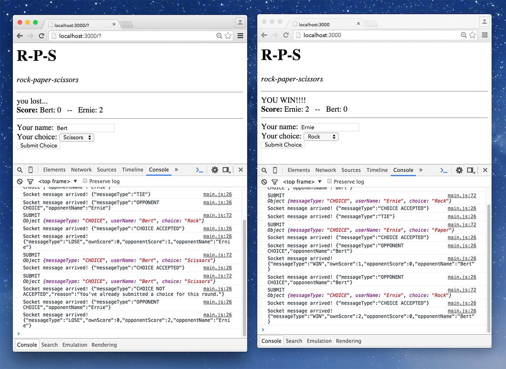

# Unit 5: Websockets

## Objectives

In this week you’ll…

- see how HTTP limits us in the kind of applications we can build, and how the Websocket protocol solves that limitation;
- understand the websocket protocol;
- learn the client-side WebSocket API;
- intergrate WebSocket functionality into an Express server app.

## Table of Contents

<!-- TOC depthFrom:2 depthTo:3 updateOnSave:false -->

- [Session 5-1: Websocket on the client](#session-5-1-websocket-on-the-client)
  - [Introduction - Opening remarks](#introduction---opening-remarks)
  - [Preparation 1: literature and Q&A](#preparation-1-literature-and-qa)
  - [Preparation 2: 'Assignment unit 5A'](#preparation-2-assignment-unit-5a)
  - [Classroom activities for session 5-1](#classroom-activities-for-session-5-1)
- [Session 5-2: Websocket on the server](#session-5-2-websocket-on-the-server)
  - [Introduction](#introduction)
  - [Preparation 1: Some questions about `ws`](#preparation-1-some-questions-about-ws)
  - [Preparation 2: Optional Q&A](#preparation-2-optional-qa)
  - [Preparation 3: Study the Rocks-Paper-Scissors client](#preparation-3-study-the-rocks-paper-scissors-client)
  - [Classroom activities for session 5-2](#classroom-activities-for-session-5-2)
  - [Assignment unit 5B - 'Rock Paper Scissors'](#assignment-unit-5b---rock-paper-scissors)
- [Session 5-3: small test](#session-5-3-small-test)
  - [Preparation](#preparation)

<!-- /TOC -->

## Session 5-1: Websocket on the client

### Introduction - Opening remarks

You've probably seen how Google Docs allows multiple users te edit the same document at the same time. That's impressive technology, and we're going to look at one part of that technology: The fact that _your_ browser seems to know the actions of the other users in near real-time.

It's interesting because that's not how the web was designed. At the core of the HTTP-protocol lies one fundamental design choice: Information exchange on the Web takes place _always and only_ at the initiative of the _browser_. The server responds to requests, and after the response has been sent, the server is free to forget all about the request (unlike, for example the FTP protocol). This was a design choice that turned out to have an interesting property: It made the web much more _scalable_ than other protocols were. A single server can serve much more HTTP requests per second than FTP requests because it doesn't have to maintain "connection state". And it's much easier to distribute the requests for a very busy site across multiple HTTP servers (with FTP this is close to impossible).

This scalability had a drawback: The price all users of the world wide web have been paying for the last twenty years is the fact that there couldn't be any web sites or applications that would update immediately whenever the _server_ got hold of new information that was of interest to the client-app. There was a certain slowness that limited the kinds of applications that webdesigners and webdevelopers could dream up and create.

People started to develop workarounds for this problem. None of them were easy, and none of them were efficient enough to support applications that needed really frequent updates from the server to the client. Websockets is an extension of the HTTP-protocol that's built to allow fine-grained, high frequency message exchange between server and client, and supports exchanges where the server takes the initiative. It's fast, and it's relatively easy. It does undo some of the scalability advantages that made HTTP so impressively scalable, but with current advanced web-technology we can often live with that.

#### How real-time is your app?

So the Websockets protocol is what enables us to develop a new class of web applications that, like Google Docs, can update very quickly when something outside the browser changes. Multiplayer games are a great example, but also dashboard apps that display the state of fast changing external data (sensors, financial info etc.). And, of course, collaborative apps in which users can interact with each other in real-time. Such as Google Docs.

Because the information that the user is looking at in his/her browser is updated almost as soon as the server knows about this new info, people started describing applications like these as _"real-time"_ applications. But the term "real-time" is also used to describe software that controls sensitive hardware (think: robots or factory machinery), where timing is absolutely crucial: You don't want an important safety valve in a nuclear power station to close a few milliseconds too late: the entire building might blow up. Such systems are sometimes called "_hard_ real-time".
For hard real time software, you need very different technology than what we use in the web development world: different programming languages, different operating systems and different computer networks. For example: the IP-protocol (which is used in both HTTP and WebSocket) does not promise or attempt to deliver data packets within a time limit. So there is no way to promise your boss or your client that the safety valve will close on time if the close command is sent over the internet.

Luckily, the kinds of web-applications that we are discussing are not as time-critical as that. For a social media app, or a collaborative document editor, some small variation in timing is probably fine. The user won't know the difference. You will encounter terms like "_soft_ real-time", or "_near_ real-time" when people try to distinguish between these two different kinds of "real time". We'll stick with the term "near real-time", or NRT. With WebSocket, the web is capable of near real-time, but not of hard real-time.

#### Before WebSocket

Actually, people were doing near real-time over the web before the WebSocket protocol became widely supported by browsers. It turned out that HTTP could be made to perform some tricks that enabled NRT. Shortly after the term AJAX became popular for using `XmlHTTPRequest`, somebody invented the name _"Comet"_ for using `XmlHTTPRequest` in a somewhat sneaky way to wait for the server to report new information to the browser at a time chosen by the server. You may encounter the name "Comet" in some literature, but it did not really stick.

These days we talk about _"long polling"_ as the main technology for doing NRT communication in Web apps before WebSocket came along. "Polling" is a general computer science term which basically means "repeatedly checking for changes". On StackOverflow user Tieme van Veen wrote a short an clear overview comparing . Please read the question and Tieme's answer on this page:

[What are Long-Polling, Websockets, Server-Sent Events (SSE) and Comet?](http://stackoverflow.com/questions/11077857/what-are-long-polling-websockets-server-sent-events-sse-and-comet)

Much of the literature about WebSocket refers to these older styles of NRT in the browser (often to say how much faster WebSocket is than these older tricks). So you need some sense of what long-polling, Comet and Server Sent Events mean before diving into WebSockets. So, before proceeding with the rest of this README, do read the article on the link above [now](http://stackoverflow.com/questions/11077857/what-are-long-polling-websockets-server-sent-events-sse-and-comet).

One word about Server Sent Events (SSE): It is basically an official way of doing long-polling, supported by all major browsers, except Internet Explorer and Microsoft Edge. This lack of support from the Mircosoft browsers is one reason why SSE is not used all that often. Websocket is the other reason: Using Websocket is just as easy as using SSE, but faster and more flexible. And WebSocket _is_ supported by IE and Edge.

### Preparation 1: literature and Q&A

1. Read the following book chapter:
   [Chapter 17 - WebSocket](https://hpbn.co/websocket/) from _High Performance Browser Networking_ by Ilya Grigorik. Some parts are not important, and may be skipped:

   - The bits about binary data transfer. For this course we'll focus on JSON, so text-based transfer is good enough right now.
   - The details about a Websocket frame. Just make sure you understand how a receiver of several frames can tell whether they must be combined into a single message, or if they contain multiple messages.
   - Everything after the heading **"Data Efficiency and Compression"**. Those chapters are about networks performance in more detail than is useful for this course.

1. Read [Writing WebSocket client applications](https://developer.mozilla.org/en-US/docs/Web/API/WebSockets_API/Writing_WebSocket_client_applications) on the Mozilla website.

1. **Q & A:** [Please submit two questions about the these texts here](https://dwa-courses.firebaseapp.com/qna_swd_5.1.html).

### Preparation 2: 'Assignment unit 5A'

In the directory "session5-1", you find a NodeJS app called "RandomSocket". The `app.js` file is an Express application that can talk over the WebSocket protocol. When it is sent a user name and a maximum value (integer), it will start sending a series of Websocket messages containing random numbers between 1 and the given maximum value. If there are multiple users connected, all random values are transmitted to all connected users.

The server app is capable of:

1. Serving static files (such as `index.html` and `main.js`) from the directory `client-side`.

1. Accepting Websocket connections on the URL: `ws://localhost:3000/random`

1. Accepting WebSocket messages that look like this:

   ```json
   {
     "userName": "Bugs Bunny",
     "maxValue": 6
   }
   ```

1. Sending messages like this:

   ```json
   {
     "type": "randomValueMessage",
     "userName": "Daffy Duck",
     "randomValue": 4
   }
   ```

   Such messages will be broadcast to all clients that have connected to the same Websocket URL. So Daffy Duck may receive random values for Bug Bunny and vice versa.

1. Closing the connection. Sometimes the connection is closed after 10 random values have been sent, sometimes after 20 messages, or some number in between.

The file `main.js` is empty, but the file `index.html` contains some simple HTML to get you started. It contains two interesting things:

1. A form that you can use to enter the userName and a maximum value, end send those to the server; and

1. An unordered list `<ul id="messageList">`. This is where your Javascript code should append items that show the messages that it receives from the server.

**Your task is to create the client code that communicates with this server.**
Here's a picture of what it should look like when two browsers are connected to the same server:


**Note:** Do not use React for this assignment. Just use regular DOM manipulation code.
For this assignment the only DOM methods you need are: `document.getElementById()`, `document.createElement()`, `element.appendChild()`, and `event.preventDefault()`. Besides those, you'll use the client-side WebSocket API, and the methods `JSON.parse()` and `JSON.stringify()`.

Here's how your code should make the client work:

- The client starts by opening a WebSocket connection to `ws://localhost:3000/random`.
- When the connection is opened successfully, the client informs the user by adding a list item to the `messageList`.
- Whenever the user presses the "Send"-button, a JSON message containing the contents of both the "User name" textfield and the "Max Value" textfield is sent to the server through the WebSocket connection.
- When a message is received, a list item is added to the `messageList` list, containing the userName and the random value.
- The server sometimes closes the websocket connection (just for practice). If the connection is closed, the client should: Add a list item containing the text "connection was closed".

**Bonus:** for extra appreciation by your teacher, implement the following feature: _As soon as the server closes the connection_ in a clean way, the client reopens the connection by creating a new WebSocket. It also sends the form data again, resulting in a restart of the stream of random value messages from the server.

[Use this form to submit the exact URL of your work on GitHub.](https://dwa-courses.firebaseapp.com/assignment_swd_5.1.html)

### Classroom activities for session 5-1

- **Q&A:** We'll try to answer as much of your questions as time will allow.
- **Disussion:** of the homework assignment about the RandomSocket app.

## Session 5-2: Websocket on the server

### Introduction

Node.JS was one of the very first web server platforms where the WebSocket protocol was supported. For many other platform, it was much more difficult to support WebSocket. Take for example the LAMP-stack (or any other combination that uses PHP and a regular Webserver): A normal setup of PHP works like this: The webserver (e.g. Apache or IIS) is the software that's always running. Whenever an HTTP request arrives, it starts the corresponding PHP-code. This PHP-code generates the response (usually the HTML-page), hands the response over to the webserver, and the webserver transmits the response over the internet to the browser. So the PHP-code _only runs_ when a browser request has arrived. There is no application-code running "between requests". So what code might send the WebSocket messages that your application might want to sent on it's own (server-side) initiative? These days there are solutions that allow WebSocket to be used by PHP, but they do tend to require that some extra software gets installed, either besides the WebServer, or as a plug-in to the webserver.

In the Node world, this problem never existed. Your Node.JS code is a continually running piece of software, where the web server software is included as a library (e.g. Express). As a programmer, you chose what code gets to run when, and you're free to support multiple network protocols from a single application. So adding WebSocket to Node.JS was not very difficult, and several Node.JS libraries appeared, and they are all excellent tools.

But. You may have already noticed that library developers in the Node.JS world are not always very good at writing extensive documentation, or at keeping introductory tutorials up to date. That is why there is no reading assignment for this session, apart from the text you're reading now.

#### Which NPM module shall we choose?

There are several WebSocket libraries on `npm`. For this session we've chosen to focus on a library called `ws` ([npm page](https://www.npmjs.com/package/ws), [github page](https://github.com/websockets/ws)). It was chosen for two reasons:

1. It's simple. It makes no attempt to do anything more than just support basic WebSocket communication.
1. It can be combined with the Express framework. Probably the others (e.g. [`websocket`](https://www.npmjs.com/package/websocket) or [`node-websocket`](https://www.npmjs.com/package/node-websoket)) can also work with Express, but for `ws` some examples were more easily available.

Besides these two arguments, `ws` is also the most popular module. That's not really a strong argument, but sometimes it feels good to run with the herd.

#### A note on Socket.IO

There is another WebSocket library that is even more prominent on in the blogsphere than `ws`: [Socket.IO](http://socket.io/). This is the big boy, the 800-pound gorilla of real-time communication for Node.JS. But it is not a simple WebSocket library. For one thing, it is not simple: it supports a lot of features that are not part of the WebSocket protocol. For another thing: it's not just about WebSockets. Here's a list of cool things Socket.IO gives you that are not part of the WebSocket protocol:

- _Fallbacks for old browsers_
  If a browser does not support the WebSocket protocol, Socket.IO will choose to use long-polling or some other trick to enable near real-time communication. As a programmer you don't have to do anything to make that work correctly.
- _Connection recovery_
  If the connection between the browser and the server-side websocket is lost by accident, Socket.IO will try to attempt to reconnect as soon as possible. This happens automatically, and is very clever and useful. But sometimes, during testing, it can be pretty annoying.
- _Rooms_
  Socket.IO allows your server-code to group connections from different browsers in virtual "rooms". Messages can then be broadcast to all connections inside a particular room. This mimics similar functionality in chat-applications, and can be very useful. With other libraries you can develop this feature yourself: it's not very complex.

The most important reason why we're not working with Socket.IO in this course, is that all these cool features (there are more, such as _namespaces_, _custom events_, etc.) make Socket.IO pretty complicated, and all this complexity is not very clearly documented. Many tutorials were written for older versions (Socket.IO 0.8 or 0.9) which is incompatible with the current one.

To understand WebSocket, and what WebSocket may mean for the future of web applications, we don't need to fight our way through all the Socket.IO complexity. Once you gain some experience and understanding of WebSocket (through the use of `ws`, in our case), you'll find that you teach yourself Socket.IO whenever your project requires some of those cool extra features.

Currently, `ws` and Socket.IO are by far the most popular `npm` modules for near real-time communication. At the time of writing, `ws` was downloaded almost 3 million times during the past month (2,893,943 to be exact) according to [npmjs.com](https://www.npmjs.com). Socket.IO was downloaded 2,058,969 times. Very impressive numbers. For comparison: Express, the most popular web framework for Node.JS, was downloaded 3,5 million times (during the past month!).

#### Learning ws

The `ws` library is not very complicated, but like many `npm` modules, figuring out how to use it requires some detective work. Your main sources of documentation are in it's [GitHub repo](https://github.com/websockets/ws):

- The [README.md](https://github.com/websockets/ws/blob/master/README.md) on GitHub
- The single documentation file [`ws.md`](https://github.com/websockets/ws/blob/master/doc/ws.md) in the `/doc` directory on Github, and
- The source code itself.

For the assignments of this session you can probably get by without digging through the source code.

Before we leave you to discover `ws` through these docs, there's one issue that we should discuss here:

#### Combining ws and Express using by creating your own HTTP-server

Websocket connections are initiated through HTTP requests. So `ws` needs a running HTTP server that it can use to see the connection requests coming in. There two ways of getting an HTTP server for `ws`:

1. Let `ws` create and manage it's own HTTP server. This is what's happening in the following example:

   ```js
   var ws = require("ws");

   var theWebSocketServer = new ws.Server({
     port: 8080
   });
   ```

   There is no HTTP server visible in the code. But, by passing a port number to the `WebSocketServer()` constructor, we're telling `ws` to create an HTTP server itself.

2. Or you can create the HTTP server yourself, and allow `ws` to use that one:

   ```js
   var ws = require("ws");
   var http = require("http");

   var theHttpServer = http.createServer();
   var theWebSocketServer = new ws.Server({
     server: theHttpServer
   });
   ```

Now we're passing in an existing HTTP server to the constructor (`http` is a built-in Node.JS module; you don't have to use `npm` to install it).

Compare the two code examples to the examples on the [README.md](https://github.com/websockets/ws/blob/master/README.md#simple-server) page for `ws` on GitHub. Their way of creating servers seems different from the examples on this page. If you look closely, though, you can see that their way of doing it is actually the same way. With different variables, but basically the same. Their code that attaches the `ws`-server to an existing HTTP server is part of their example for using Express with `ws`.

In that example they also attach the Express `app` to the very same HTTP server that `ws` has been attached to. Express, like `ws` needs an HTTP server to function, and, like `ws`, it can create it's own HTTP server _or_ attach to an existing HTTP server. The magic happens on the line

```js
server.on("request", app);
```

(where `app` it the Express application object, and `server` is the HTTP server object). So here's a simplified version of setting up Express and `ws` together:

```js
var express = require("express");
var ws = require("ws");
var http = require("http");
var path = require("path");

var theExpressApp = express();
var theHttpServer = http.createServer();
var theWebSocketServer = new ws.Server({
  server: theHttpServer
});

// code to setup the Express app (middleware, routes) can go here; eg:
theExpressApp.use(express.static(path.join(__dirname, "client-side")));

// code to setup event listeners for WebSocket communication can go here

// connect the Express App to all incoming requests on the HTTP server
theHttpServer.on("request", theExpressApp);
theHttpServer.listen(3000, function() {
  console.log("The Server is listening on port 3000.");
});
```

Feel free to use this starter-code in your own applications.

### Preparation 1: Some questions about `ws`

Answer the following questions using the `ws` docs on Github ([README.md](https://github.com/websockets/ws/blob/master/README.md) and [`ws.md`](https://github.com/websockets/ws/blob/master/doc/ws.md)).
If you can't see the answer immediately, try not to give up before you've tried to...

- ...find the answer in some of the example code;
- ...perform an experiment (a small program of your own) based on some of the documentation to test how some stuff works (`console.log` is an experimenter's best friend!);
- ...search on the Internet for an answer. Google of StackOverflow can be very useful. But **be aware!** many of the articles and posts you find online are about much older versions of `ws` or Node.JS. Make sure you test whether an answer works in the current versions of Node and `ws`.

You can answer a question by giving a code examples. But do **place comments** in such example code to show that you actually understand the code.

[Find the questions and submit your answers here.](https://dwa-courses.firebaseapp.com/qna_swd_5.2.html)

### Preparation 2: Optional Q&A

If you have any questions you would like your lecturer to answer during class, please [post them here.](https://dwa-courses.firebaseapp.com/qna_swd_5.2.html)

### Preparation 3: Study the Rocks-Paper-Scissors client

Rocks-Paper-Scissors is a simple two player game: both players choose (without knowing what the other one is choosing) one of either Rock or Paper or Scissors. They show their choice at the same time (in the real life version they use hand gestures), and compare the choices to determine the winner:

- Scissors defeat Paper
- Rock defeats Scissors
- Paper defeats Rock

The game is often played in multiple rounds. Here's a [more interesting introduction to the game](http://southbendgamingcommunity.blogspot.nl/2010/12/rock-paper-scissors-introduction.html).

In class you will start writing the server app for a very simple WebSocket based implementation of this game. Here are some screenshots of how this app will work:

#### There have been two rounds. Ernie just won a round



#### In the next round, Bert is the first to submit his choice ("Paper")


#### Ernie submits "Rock", and the server tells both browsers who won, who lost, and what the new score is


#### Now Ernie is first to submit a choice in the new round


#### But when Ernie submits again (before Bert), he receives an error message


#### Another error message will be displayed if a third browser tries to connect to this server


**Question 1:**
You can find the front-end code (html with plain JavaScript) in your repo.

- Study it carefully; especially the `main.js` file in the `/client-side` folder.
- Make a list of all kinds of messages that are sent, and all kinds of messages that are received. What extra field do those messages carry?

[Please submit your list of messages here](https://dwa-courses.firebaseapp.com/qna_swd_5.2.html)

**Question 2:**
Study the source code for the RandomSocket app that you used in session 5-1. There is one particular trick you need to notice: for each client that is connected, the server app needs to keep track of the userName and maxValue (among other data). Where does the server store this information, and how does it associate the right user name (for example) with the right websocket connection?

[Submit your answer here](https://dwa-courses.firebaseapp.com/qna_swd_5.2.html)

### Classroom activities for session 5-2

- **Homework discussion:** We'll discuss your answers to the questions about the `ws` library.
- **Q&A:** We'll try to answer the questions you may have submitted to the optional Q&A.

### Assignment unit 5B - 'Rock Paper Scissors'

[Create the server code for the Rock-Paper-Scissors game and submit the url of your github commit here](https://dwa-courses.firebaseapp.com/assignment_swd_5.2.html)

## Session 5-3: small test

### Preparation

Prepare for the small test by studying:

1. The [introductory text](#introduction---opening-remarks) for session 5-1 (near the top of this README).
1. The article about the WebSocket-protocol that was part of the preparation for session 5-1:
   [Chapter 17 - WebSocket](https://hpbn.co/websocket/) from _High Performance Browser Networking_ by Ilya Grigorik.
1. The article about using the WebSocket API in a browser, that was part of the preparation for session 5-1:
   [Writing WebSocket client applications](https://developer.mozilla.org/en-US/docs/Web/API/WebSockets_API/Writing_WebSocket_client_applications) on the Mozilla website.
1. The [introductory text](#introduction) for session 5-2 (near the middle of this README).
1. The answers to the research questions about `ws` that were part of the preparation for session 5-2.
